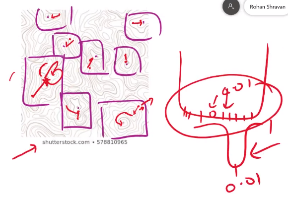
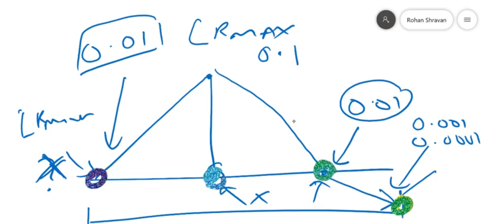
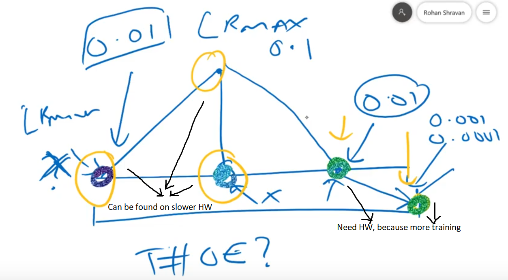
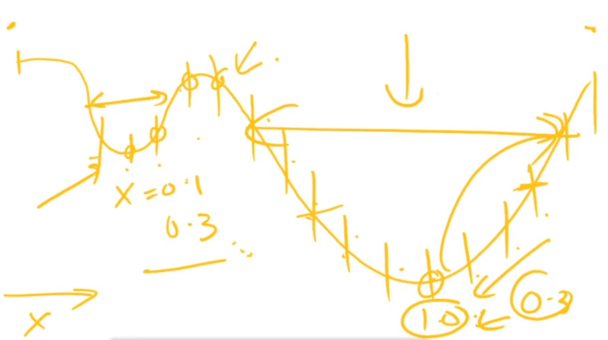

# Super Convergence

Finding a good Learning Rate. 

Learning Rate can be anywhere from and can be increased from 0 - 10

Recently it was shown that using certain hyper-parameter values, using a very large learning rates with the cyclical learning rate (CLR) method, we can speed up training by an order of magnitude. This phenomenon is  called  **super convergence** .

Starting Learning Rate - How to find an optimal starting learning rate.

If set too low - Time consuming due to small weights updates.

---

### How  to reach super convergence ?

By finding optimal learning rate.  An optimal learning rate will decrease the loss significantly 

A systematic approach would be  by finding relation between learning rate and loss obtained wrt that learning rate. 

​	Learning rate : Loss

if 100K images and batch size of 100 we will run it 1000 times or 1000 Iterations 

As the Iteration increases the learning rate changes and with change in learning rate there is change in losses.

- With change in Iteration there is changes in learning rate. The change in learning rate can be linear or exponential.

- With change in learning rate there is change in losses.

#### Setup 

1. Weights are random
2. Batch may change
3. Only Learning rate changes.
4. Loss is calculated 
5.  Iteration vs learning rate vs losses is calculated.
6. BP is not applied
7. BP is not applied is a LIE

Because  if we don't apply BP  our loss is constant for constant values of  W, $\theta$ , $R$ .

>  So we do use BP. 

For BP step

$$
\theta^1 =\theta^0 - \alpha (\hat y - y)
$$
where $\hat y$ is hypothesis function 

> What values of changes in theta has the most jump toward minima or towards convergence.

For example if our optimum theta value is 0.00032 and our $\alpha$ is 0.01 and loss/gradient received is 0.01

For $\alpha = 0.01$ and loss value  $= 0.01$ Output =  0.0001 with a difference of 0.0002

For $\alpha = 0.02$ and loss value  $= 0.01$ Output =  0.0002 with a difference of 0.0001

Also important point to remember is that 1/3 of the data is being use to figure out the LR

---

### Learning Rate Annealing

HEAT AND THEN SLOWLY LET IT COOL - METAL or LR

There are types of annealing - 

Main Objective - Useful to define a Learning Rate Scheduler- Update in LR based in a rule.

### Warmup Strategies

Constant Warmup  - May miss, Hence start slow

Gradual Warmup - Start slow and increase exponentially

---

## Cyclic Learning Rate

- LR Annealing starts with a high LR and gradually decrease 

- Warmup strategies start with low LR and gradually increase 

Where will Annealing fail, with a LARGE LR we might push $\theta$ further away from minima and hence take longer to come back towards direction of minim and this entire process may happen again, hence annealing will help gradually but slowly proceed to minima but it is still possible to be stuck in a bucket shape minima , a we might be stuck there for smaller values of LR. A gradual warmup in this situation will help us push $\theta$ towards minima. Hence cyclic  learning rate using Warmup and LR Annealing.

Insert 3

A cycle  has two step  going up and going down.  Length of a cycle is number of iterations performed doing 2 steps.

A cycle is performed using measure of max_lr and min_lr

Plot a graph between Loss and LR for 1/3 of the data set.

Hence ,

1. Plot loss again LR.

2. Pick LR where loss is lowest.
3. Then divide that number/LR by 10.
4. Shuffle between those two numbers.

---

## One Cylic Learning Rate

Very Fast, Same accuracy  or better as CLR with just one cycle.

Spent more time learning, to figure out hyperparameters to train model fast.

Why train faster ? Competition yes. 

Companies ? - Traing New DS for and hour to figure out if a certain maximum accuracy possible. 

A company rather than spending time on training to maximize accuracy can use OClr  and fine tune learning parameter and run using that LR to attain maximum accuracy.

LR_max  = is fugured

What we know and what we dont know.

Total number of epochs we dont know.

 

why go to Lr_max so that we dont jump out of deeper minimas

