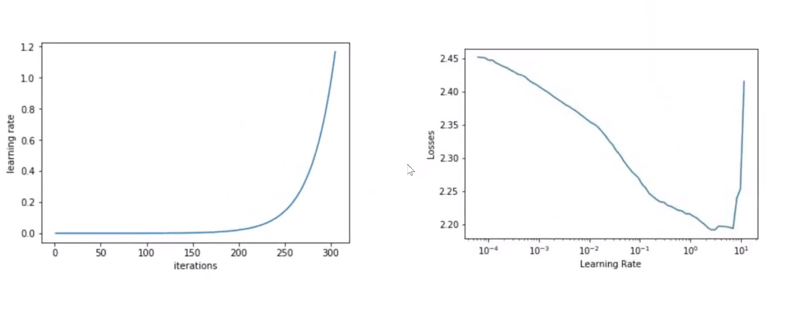

# Super Convergence

Finding a good Learning Rate. 

Learning Rate can be anywhere from and can be increased from 0 - 10

Recently it was shown that using certain hyper-parameter values, using a very large learning rates with the cyclical learning rate (CLR) method, we can speed up training by an order of magnitude. This phenomenon is  called  **super convergence** .

Starting Learning Rate - How to find an optimal starting learning rate.

If set too low - Time consuming due to small weights updates.

How  to reach super convergence ?

By finding optimal learning rate.  An optimal learning rate will decrease the loss significantly 

A systematic approach would be  by finding relation between learning rate and loss obtained wrt that learning rate. 

​	Learning rate : Loss

if 100K images and batch size of 100 we will run it 1000 times or 1000 Iterations 

As the Iteration increases the learning rate changes and with change in learning rate there is change in losses.

- With change in Iteration there is changes in learning rate. The change in learning rate can be linear or exponential.

- With change in learning rate there is change in losses.

Setup 

1. Weights are random
2. Batch may change
3. Only Learning rate changes.
4. Loss is calculated 
5.  Iteration vs learning rate vs losses is calculated.
6. BP is not applied
7. BP is not applied is a LIE

Because  if we don't apply BP  our loss is constant for constant values of  W, $\theta$ , $R$ .

So we do use BP

So, my question here is the 